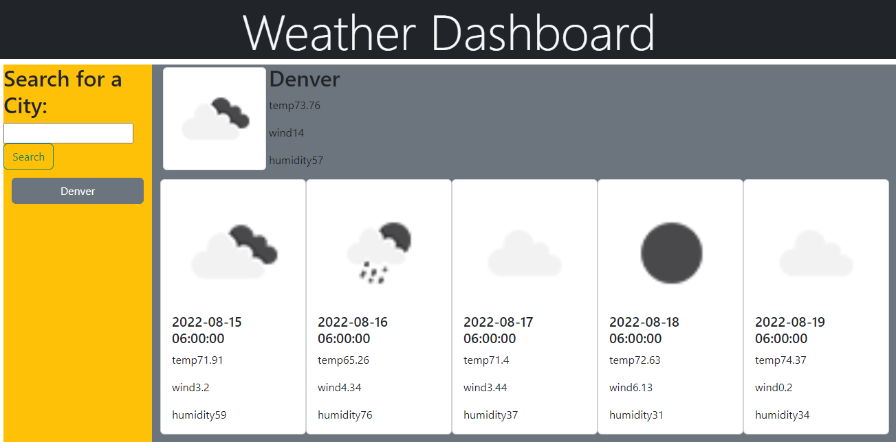

# 
<!DOCTYPE html>
<html lang="en-US">

  <head>
    weatherDashboard 
  </head>

  <body>
     
    <a href="https://l1keafox.github.io/weatherDashboard" target="no_blank">Click here for weatherDashboard </a> 
     
    
  </body>

</html>

# <Your-Project-Title>

## Description

An website that show you weather for the next five days for any city entered. Click <a href="https://l1keafox.github.io/weatherDashboard" target="no_blank">here </a> for repo.

---

## Credits

  Raymond Lewis

---

